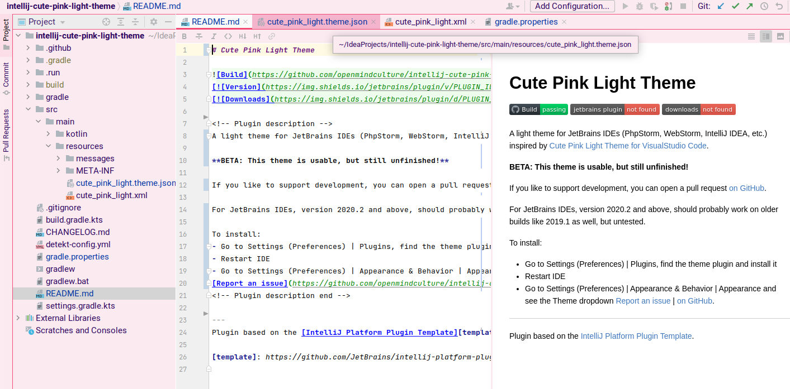

# Cute Pink Light Theme

<!-- Plugin description -->
[Cute Pink Light Theme](https://plugins.jetbrains.com/plugin/16721-cute-pink-light-theme) is a light IDE theme for JetBrains IDEs (PhpStorm, WebStorm, IntelliJ IDEA, etc.) inspired by [a theme for VisualStudio Code](https://marketplace.visualstudio.com/items?itemName=webfreak.cute-theme). This theme adds cute pink colors to your IDE, keeping the default light theme for editor and unchanged syntax highlighting. Based on JetBrains default light theme.

**BETA: This theme is usable, but still unfinished!**

If you like to support development, you can open a pull request [on GitHub](https://github.com/openmindculture/intellij-cute-pink-light-theme).

For JetBrains IDEs, version 2020.2 and above. Tested up to 2022.1. It will probably work on older builds like 2019.1 as well, but untested.

To install:
- Go to Settings (Preferences) | Plugins, find the theme plugin and install it
- (_or_ download [Cute Pink Light Theme from JetBrains Plugins page](https://plugins.jetbrains.com/plugin/16721-cute-pink-light-theme)) 
- Restart IDE
- Go to Settings (Preferences) | Appearance & Behavior | Appearance and see the Theme dropdown
[Report an issue](https://github.com/openmindculture/intellij-cute-pink-light-theme/issues/new) | [on GitHub](https://github.com/openmindculture/intellij-cute-pink-light-theme).
<!-- Plugin description end -->

If you only want to install the theme, you do not need this repository.
You can install the theme from JB marketplace (inside your IDE) or install zip file (see below).

### Screenshot

### Local Installation

In `build/distributions` there is a zip file that I can manually import into my regular PhpStorm installation (Settings -> Plugins -> Gear Icon -> install plugin from disk).

### Development

Recommended development environment is IntelliJ IDEA Ultimate, to benefit from pre-configured build actions etc. like described by JetBrains in the [custom UI theme workflow](https://plugins.jetbrains.com/docs/intellij/themes.html#custom-ui-theme-workflow).

- Edit colors in `src/main/META-INF/cute_pink_light_theme.json`.
- `Build` the project from IntelliJ Build menu.
- `Run Verifications` recreates artifacts.
- `Run plugin` loads a theme preview into a new instance of IntelliJ IDEA.
- Exported plugin will be created as a `.zip` archive in `build/distributions`.
- See local installation above to verify the theme in any other JB IDE, like PHPStorm.

#### Fix Problems and Incompatibilities

If the build does not run anymore, try to

- upgrade dependencies if necessary
- merge upgrades from [IntelliJ Platform Plugin Template](https://github.com/JetBrains/intellij-platform-plugin-template)
- look up error messages, issues, workarounds in [YouTrack](https://youtrack.jetbrains.com/)
- set VM options `--add-opens=java.base/java.io=ALL-UNNAMED --illegal-access=deny` to Run Verifications task as a workaround for [IDEA-210683 Illegal reflective access in IJ codebase](https://youtrack.jetbrains.com/issue/IDEA-210683) and possibly also in general Java / Kotlin options in IDE settings
- use a current IntelliJ IDEA version (evaluation version should be enough)
- [clear IntelliJ cache folders](https://intellij-support.jetbrains.com/hc/en-us/community/posts/360003086459-kotlin-gradle-dsl-type-mismatch-expected-java-lang-string-but-inferred-type-is-kotlin-string) (~/.cache/JetBrains/...)
- clear gradle cache (~/.gradle/caches/*)
- (re)build project

Workaround for failing searchable options:
- build using gradle wrapper on the command line
- skip subtask to build searchable options
  `./gradlew buildPlugin --exclude-task buildSearchableOptions`
The workaround causes a "plugin error" in the IDE on every IDE start, although the plugin still works as expected.

Ongoing discussion in JetBrains YouTrack issue (marked as fixed, but still does not work for me):
[youtrack.jetbrains.com/issue/IDEA-292389/build-plugin-for-20221-error](https://youtrack.jetbrains.com/issue/IDEA-292389/build-plugin-for-20221-error)

StackOverflow issue describing the current state of the project producing either a fatal error at build time or a non-critical error at run time when using an IDE with the latest plugin version:
[stackoverflow.com/questions/72951395/intellij-theme-plugin-fails-to-build-fatal-error-trying-to-buildsearchableoptio](https://stackoverflow.com/questions/72951395/intellij-theme-plugin-fails-to-build-fatal-error-trying-to-buildsearchableoptio)

#### Upgrade Plugin for new IDEA versions

- bump plugin version
- add current IDEA version to supported targets
- rebuild artifacts as described above

### Author

I am Ingo Steinke ([@openmindculture](https://github.com/openmindculture) on GitHub) a creative web developer, creating sustainable software and websites. If you like my [talks](https://www.ingo-steinke.com/#talks-events) and articles, feel free to [support me on patreon](https://www.patreon.com/ingosteinke), [buy me a coffee](https://www.buymeacoffee.com/ingosteinke) or [hire me as a freelancer](https://www.ingo-steinke.com/#contact).

---
Plugin based on the [IntelliJ Platform Plugin Template][template].

[template]: https://github.com/JetBrains/intellij-platform-plugin-template
