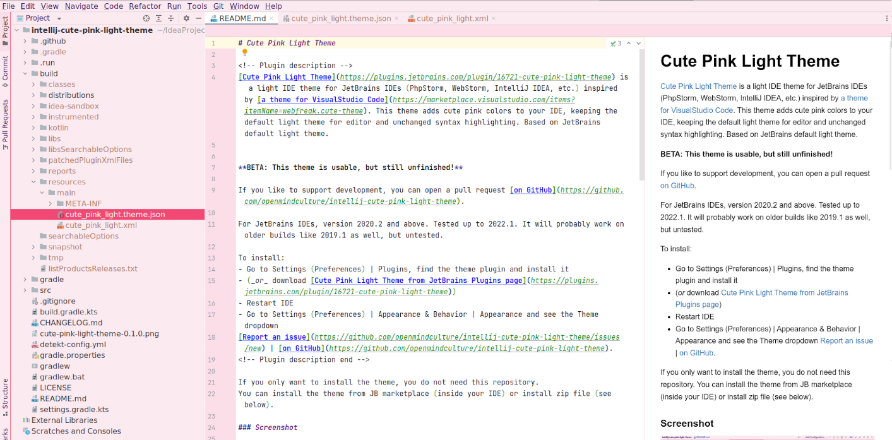

# Cute Pink Light Theme

<!-- Plugin description -->
[Cute Pink Light Theme](https://plugins.jetbrains.com/plugin/16721-cute-pink-light-theme) is a light IDE theme for JetBrains IDEs (PhpStorm, WebStorm, IntelliJ IDEA, etc.) inspired by [a theme for VisualStudio Code](https://marketplace.visualstudio.com/items?itemName=webfreak.cute-theme). This theme adds cute pink colors to your IDE, keeping the default light theme for editor and unchanged syntax highlighting. Based on JetBrains default light theme.


**BETA: This theme is usable, but still unfinished!**

If you like to support development, you can open a pull request [on GitHub](https://github.com/openmindculture/intellij-cute-pink-light-theme).

For JetBrains IDEs, version 2020.2 and above. Tested up to 2022.1. It will probably work on older builds like 2019.1 as well, but untested.

To install:
- Go to Settings (Preferences) | Plugins, find the theme plugin and install it
- (_or_ download [Cute Pink Light Theme from JetBrains Plugins page](https://plugins.jetbrains.com/plugin/16721-cute-pink-light-theme)) 
- Restart IDE
- Go to Settings (Preferences) | Appearance & Behavior | Appearance and see the Theme dropdown
[Report an issue](https://github.com/openmindculture/intellij-cute-pink-light-theme/issues/new) | [on GitHub](https://github.com/openmindculture/intellij-cute-pink-light-theme).
<!-- Plugin description end -->

If you only want to install the theme, you do not need this repository.
You can install the theme from JB marketplace (inside your IDE) or install zip file (see below).

### Screenshot



### Local Installation

In `build/distributions` there is a zip file that I can manually import into my regular PhpStorm installation (Settings -> Plugins -> Gear Icon -> install plugin from disk).

### Development

[Cute Pink Light Theme (openmindculture/intellij-cute-pink-light-theme)](https://github.com/openmindculture/intellij-cute-pink-light-theme)
can be used as an upstream repository for variations like
[Cute Pink Dark Theme (intellij-cute-pink-dark-theme)](https://github.com/openmindculture/intellij-cute-pink-dark-theme).

```
git checkout git@github.com:openmindculture/intellij-cute-pink-dark-theme.git
cd intellij-cute-pink-dark-theme.git
git remote add upstream git@github.com:openmindculture/intellij-cute-pink-light-theme.git
```

Recommended development environment is IntelliJ IDEA Ultimate, to benefit from pre-configured build actions etc. like described by JetBrains in the [custom UI theme workflow](https://plugins.jetbrains.com/docs/intellij/themes.html#custom-ui-theme-workflow). But this is not necessary for a simple theme plugin.

> A plugin consisting of a single .jar file is placed in the /plugins directory.
Source: https://plugins.jetbrains.com/docs/intellij/plugin-content.html

For anyone planning to create a new theme plugin: you probably do not need a complex Gradle setup, as there is a new
wizard for creating a UI theme. See:
- https://blog.jetbrains.com/platform/2021/10/themes-in-intellij-based-ides/
- https://plugins.jetbrains.com/docs/intellij/theme-structure.html

To find out the internal names of UI elements, we can now use the [UI inspector](https://blog.jetbrains.com/platform/2021/10/themes-in-intellij-based-ides/#UI_Inspector%EF%BB%BF):
> The UI Inspector is a powerful tool to investigate the IntelliJ-based IDE UI elements to get an internal description of each element. In addition, UI elements can be tested interactively with Ctrl+Alt+Click on the element.
>
> Before using the UI Inspector, it must be enabled by selecting the menu item Tools | Internal Actions | UI | UI Inspector. The enabled state of the UI Inspector is modal; it remains enabled until it is disabled by selecting the menu item again.
>
> If the menu item Tools | Internal Actions is not available in IntelliJ IDEA, then the first step is [Enabling Internal Mode](https://plugins.jetbrains.com/docs/intellij/enabling-internal.html):
>
> From the main menu, select Help | Edit Custom Properties... This selection opens IntelliJ IDEA's idea.properties file. If it does not exist, IntelliJ IDEA will prompt to create one.
>
> Add the line shown below to the idea.properties file:
>
> `idea.is.internal=true`
> Save the idea.properties file and restart IntelliJ IDEA.

More information about colors and fonts can be found here: https://www.jetbrains.com/help/idea/configuring-colors-and-fonts.html

### Development, Build and Export

- Edit colors in `src/main/META-INF/cute_pink_light_theme.json`.
- Edit theme version, supported IDE versions, and other data, in 
  - `src/main/resources/META-INF/plugin.xml`
  - `src/main/resources/META-INF/MANIFEST.MF` (only used for alternative manual export)
  - `gradle.properties` (only used for IntelliJ gradle build)
  - `build.gradle.kts` (only used for IntelliJ gradle build)
- Edit the `CHANGELOG.md` 

#### IntelliJ Gradle Build 

- `Build` the project from IntelliJ Build menu.
- `Run Verifications` recreates artifacts.
  - the actual verification can be skipped for a theme plugin that does not implement any code,
  - `:buildPlugin` can be used to build the plugin artifacts
- `Run plugin` loads a theme preview into a new instance of IntelliJ IDEA.
- Exported plugin will be created as a `.zip` archive in `build/distributions`.
- We can manually remove `searchableOptions.jar from the exported plugin zip file
to further optimize and clean up our build. (TODO: should be achieved using configuration)
- See local installation above to verify the theme in any other JB IDE, like PHPStorm.

#### Alternative Manual Export (without IntelliJ Build Process)

Create an archive `intellij-cute-pink-light-theme-x.y.z.zip` containing:
  - `intellij-cute-pink-light-theme/` 
    - `lib/`
      - `intellij-cute-pink-light-theme-x.y.z.jar`
        The `.jar` file is another zip archive containing the contents of `src/main/resources`
        with **no additional folder in between, e.g.:
          - `cute_pink_light.theme.json`
          - `cute_pink_light.xml`
          - `META-INF/`
            - `plugin.xml`
            - `pluginIcon.svg`
            - `MANIFEST.MF`

A valid `MANIFEST.MF` example is included to simplify theme export and update.

You can use the build script `./build.sh $version` to build, e.g.
`./build.sh 2.9.0`

#### Fix Problems and Incompatibilities

If the build does not run anymore, try to

- upgrade dependencies if necessary
- merge upgrades from [IntelliJ Platform Plugin Template](https://github.com/JetBrains/intellij-platform-plugin-template)
- look up error messages, issues, workarounds in [YouTrack](https://youtrack.jetbrains.com/)
- set VM options `--add-opens=java.base/java.io=ALL-UNNAMED --illegal-access=deny` to Run Verifications task as a workaround for [IDEA-210683 Illegal reflective access in IJ codebase](https://youtrack.jetbrains.com/issue/IDEA-210683) and possibly also in general Java / Kotlin options in IDE settings
- use a current IntelliJ IDEA version (evaluation version should be enough)
- [clear IntelliJ cache folders](https://intellij-support.jetbrains.com/hc/en-us/community/posts/360003086459-kotlin-gradle-dsl-type-mismatch-expected-java-lang-string-but-inferred-type-is-kotlin-string) (`rm -rf ~/.cache/JetBrains/*`)
- clear gradle cache (`rm -rf ~/.gradle/caches/*`)
- (re)build project

#### Upgrade Plugin for new IDEA versions

- bump plugin version
- add current IDEA version to supported targets
- rebuild artifacts as described above

### Author

I am Ingo Steinke ([@openmindculture](https://github.com/openmindculture) on GitHub) a creative web developer, creating sustainable software and websites. If you like my [talks](https://www.ingo-steinke.com/#talks-events) and articles, feel free to [support me on patreon](https://www.patreon.com/ingosteinke), [buy me a coffee](https://www.buymeacoffee.com/ingosteinke) or [hire me as a freelancer](https://www.ingo-steinke.com/#contact).

---
Plugin based on the [IntelliJ Platform Plugin Template][template].

[template]: https://github.com/JetBrains/intellij-platform-plugin-template
